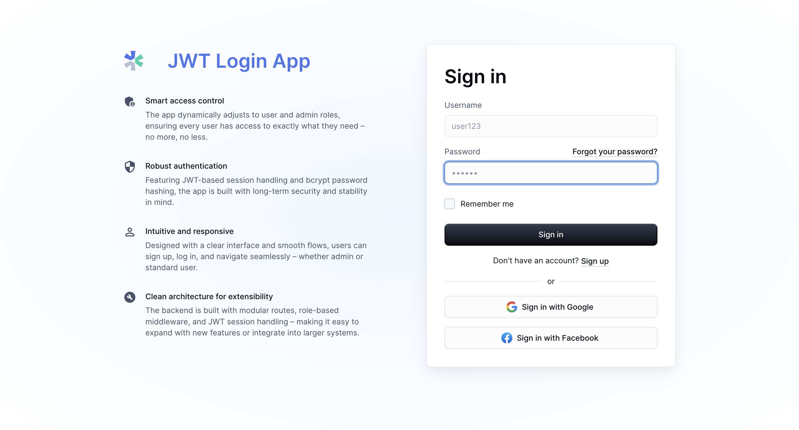

# JWT Login App

A modern, secure authentication system built with React, Node.js, and MongoDB. Features JWT-based authentication, role-based access control, and a responsive Material-UI interface.



## 🚀 Features

### Authentication & Security
- **JWT Token Authentication** with secure token validation
- **Password Hashing** using bcrypt with 12 salt rounds
- **Token Blacklisting** for secure logout functionality
- **Client & Server-side Token Validation**
- **Session & Local Storage** token management
- **CORS Protection** with configurable origins

### User Management
- **User Registration** with comprehensive validation
- **Role-based Access Control** (User/Admin)
- **Profile Management** with user information display
- **Account Deletion** with confirmation dialogs
- **Admin Panel** for user management (admin users only)

### Frontend Features
- **Responsive Design** with Material-UI components
- **Dark/Light Theme** support
- **Tab-based Navigation** for different sections
- **Loading States** and error handling
- **Snackbar Notifications** for user feedback
- **Form Validation** with real-time feedback

### Backend Features
- **RESTful API** with proper HTTP status codes
- **Input Validation** and sanitization
- **Error Handling** with detailed error messages
- **Database Connection** monitoring
- **Health Check Endpoint** for monitoring
- **Security Headers** implementation

## 📁 Project Structure

```
JWT-Login-App/
├── client/                          # React Frontend
│   ├── src/
│   │   ├── Dashboard/               # Dashboard components
│   │   │   ├── Components/          # Dashboard sub-components
│   │   │   │   ├── AdminPanel.tsx   # Admin user management
│   │   │   │   └── UserInfo.tsx     # User profile display
│   │   │   └── Dashboard.tsx        # Main dashboard component
│   │   ├── SignIn/                  # Authentication components
│   │   │   ├── components/          # Sign-in sub-components
│   │   │   │   ├── Content.tsx      # Landing page content
│   │   │   │   ├── SignInCard.tsx   # Login form
│   │   │   │   ├── SignUpCard.tsx   # Registration form
│   │   │   │   └── ForgetPassword.tsx
│   │   │   └── SignInSide.tsx       # Main auth interface
│   │   ├── shared-theme/            # Shared UI components
│   │   │   ├── AppDialog.tsx        # Reusable dialog component
│   │   │   ├── AppLayout.tsx        # Main layout wrapper
│   │   │   ├── AppTheme.tsx         # Theme configuration
│   │   │   └── TranparentAppBar.tsx # Navigation bar
│   │   ├── types/                   # TypeScript type definitions
│   │   │   └── User.ts              # User data types
│   │   ├── utils/                   # Utility functions
│   │   │   ├── SnackbarContext.tsx  # Notification context
│   │   │   └── validateFormFields.ts
│   │   └── main.jsx                 # Application entry point
│   └── package.json
├── server/                          # Node.js Backend
│   ├── Controllers/                 # Business logic handlers
│   │   ├── authController.js        # Authentication logic
│   │   ├── userController.js        # User management logic
│   │   └── adminController.js       # Admin operations logic
│   ├── Models/                      # Database models
│   │   ├── userModel.js             # User schema
│   │   └── BlacklistedToken.js      # Token blacklist schema
│   ├── Routers/                     # API route definitions
│   │   ├── authRouter.js            # Authentication routes
│   │   ├── userRouter.js            # User management routes
│   │   └── adminRouter.js           # Admin routes
│   ├── server.js                    # Server entry point
│   └── package.json
└── README.md
```

## 🛠️ Technology Stack

### Frontend
- **React 18** - UI framework
- **Material-UI (MUI)** - Component library
- **React Router** - Client-side routing
- **Vite** - Build tool and dev server
- **TypeScript** - Type safety (partial)

### Backend
- **Node.js** - Runtime environment
- **Express.js** - Web framework
- **MongoDB** - Database
- **Mongoose** - ODM for MongoDB
- **JWT** - Token-based authentication
- **bcrypt** - Password hashing
- **CORS** - Cross-origin resource sharing

## 🚀 Getting Started

### Prerequisites
- Node.js (v16 or higher)
- MongoDB (local or cloud instance)
- npm or yarn package manager

### Installation

1. **Clone the repository**
   ```bash
   git clone <repository-url>
   cd JWT-Login-App
   ```

2. **Set up environment variables**
   Create a `.env` file in the root directory:
   ```env
   MONGO_URI=mongodb://localhost:27017/jwt-login-app
   PORT=3001
   JWT_SECRET_KEY=your-super-secret-jwt-key
   CLIENT_URL=http://localhost:5173
   NODE_ENV=development
   ```

3. **Install dependencies**
   ```bash
   # Install server dependencies
   cd server
   npm install

   # Install client dependencies
   cd ../client
   npm install
   ```

4. **Start the development servers**
   ```bash
   # Start backend server (from server directory)
   npm start

   # Start frontend dev server (from client directory)
   npm run dev
   ```

5. **Access the application**
   - Frontend: http://localhost:5173
   - Backend API: http://localhost:3001
   - Health Check: http://localhost:3001/health

## 📚 API Documentation

### Authentication Endpoints

#### POST `/auth/login`
User login endpoint.
```json
{
  "username": "user@example.com",
  "password": "password123"
}
```

#### POST `/auth/signup`
User registration endpoint.
```json
{
  "username": "newuser",
  "password": "password123",
  "role": "user",
  "firstName": "John",
  "lastName": "Doe",
  "email": "john@example.com",
  "gender": "male"
}
```

#### POST `/auth/logout`
User logout endpoint (requires Authorization header).

#### GET `/auth/checkToken`
Token validation endpoint (requires Authorization header).

### User Endpoints

#### GET `/user/profile`
Get user profile (requires Authorization header).

#### DELETE `/user/deleteUser`
Delete user account (requires Authorization header).

### Admin Endpoints

#### GET `/admin/getAllUsers`
Get all users (admin only, requires Authorization header).

#### DELETE `/admin/deleteUserByAdmin`
Delete user by admin (admin only, requires Authorization header).
```json
{
  "userId": "user-id-to-delete"
}
```

## 🔒 Security Features

### Authentication Security
- **JWT Tokens** with 1-hour expiration
- **Token Blacklisting** for secure logout
- **Password Hashing** with bcrypt (12 salt rounds)
- **Input Validation** and sanitization
- **CORS Protection** with configurable origins

### Data Protection
- **No Sensitive Data** in JWT payloads
- **Secure Headers** (XSS, CSRF protection)
- **Request Size Limits** (10MB max)
- **Error Message Sanitization** in production

### Best Practices
- **Environment Variables** for configuration
- **Proper HTTP Status Codes**
- **Comprehensive Error Handling**
- **Input Validation** on both client and server
- **Database Connection Monitoring**

## 🎨 UI/UX Features

### Responsive Design
- **Mobile-first** approach
- **Breakpoint-based** layouts
- **Flexible Grid System**

### Theme Support
- **Dark/Light Mode** toggle
- **Custom Color Palette**
- **Consistent Typography**

### User Experience
- **Loading States** for async operations
- **Error Handling** with user-friendly messages
- **Form Validation** with real-time feedback
- **Confirmation Dialogs** for destructive actions

## 🧪 Development Guidelines

### Code Structure
- **Component-based** architecture
- **Separation of Concerns** (MVC pattern)
- **Modular File Organization**
- **Consistent Naming Conventions**

### Code Quality
- **Comprehensive Comments** and documentation
- **Type Safety** (TypeScript interfaces)
- **Error Handling** at all levels
- **Consistent Code Formatting**

### Testing
- **API Testing** with REST client
- **Manual Testing** workflows
- **Error Scenario** testing

## 🚀 Deployment

### Frontend Deployment
```bash
cd client
npm run build
# Deploy dist/ folder to your hosting service
```

### Backend Deployment
```bash
cd server
npm install --production
# Set NODE_ENV=production
# Deploy to your hosting service
```

### Environment Variables for Production
```env
MONGO_URI=your-production-mongodb-uri
PORT=3001
JWT_SECRET_KEY=your-production-secret-key
CLIENT_URL=https://your-frontend-domain.com
NODE_ENV=production
```

## 🤝 Contributing

1. Fork the repository
2. Create a feature branch (`git checkout -b feature/amazing-feature`)
3. Commit your changes (`git commit -m 'Add amazing feature'`)
4. Push to the branch (`git push origin feature/amazing-feature`)
5. Open a Pull Request

## 📝 License

This project is licensed under the MIT License - see the LICENSE file for details.

## 🆘 Support

For support and questions:
- Create an issue in the repository
- Check the API documentation
- Review the code comments for implementation details

## 🔄 Version History

- **v1.0.0** - Initial release with basic authentication
- **v1.1.0** - Added admin panel and user management
- **v1.2.0** - Improved code structure and documentation
- **v1.3.0** - Enhanced security features and error handling
